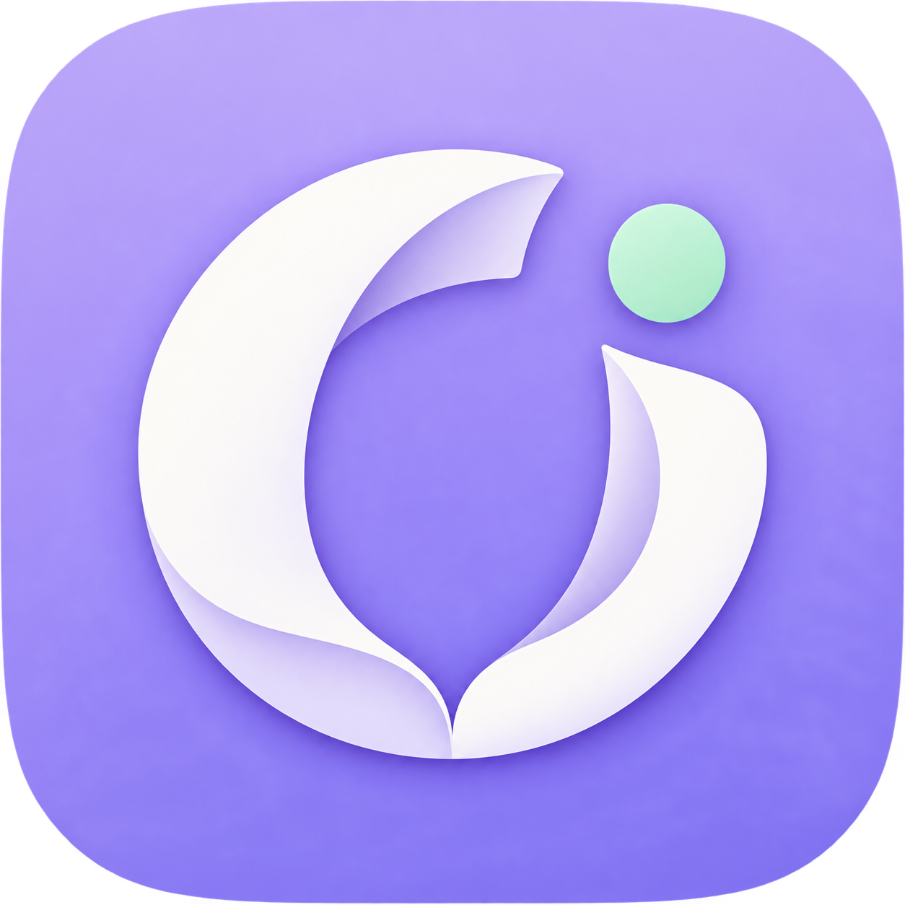
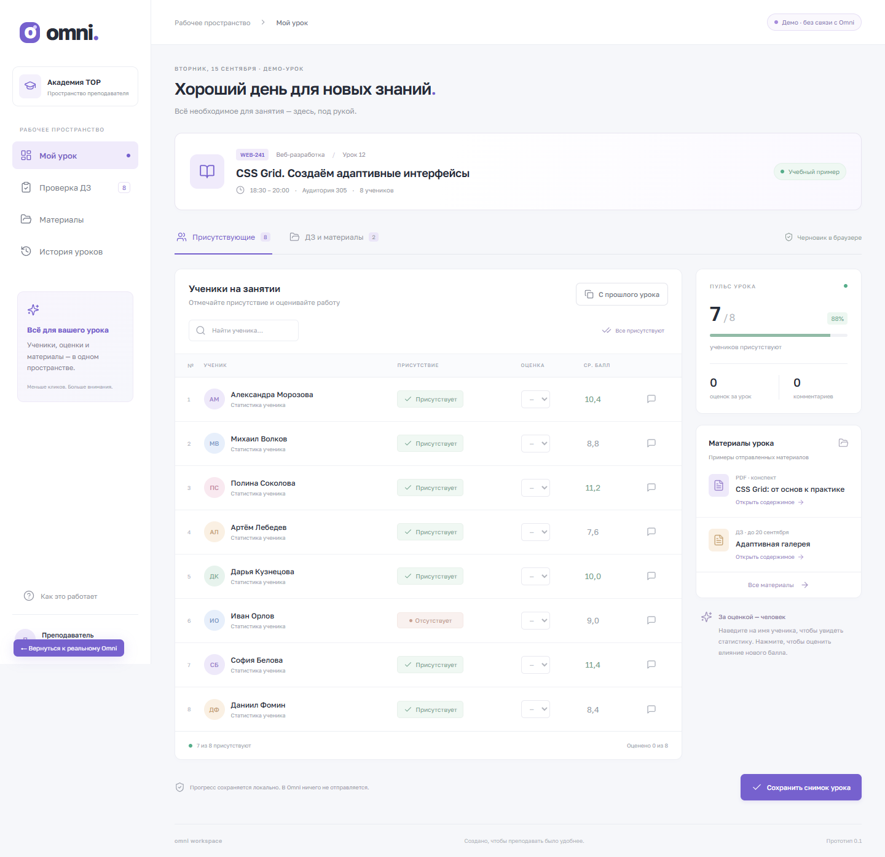

<p align="center">
  
</p>

<h1 align="center">Omni Workspace</h1>

<p align="center">Расписание, ученики и материалы — в одном рабочем пространстве преподавателя.</p>

<p align="center">
  <a href="LICENSE"></a>
  <a href="https://github.com/Anen135/omni-workspace/actions/workflows/ci.yml"></a>
</p>

Независимый локальный интерфейс для преподавателей, работающих с [Omni академии TOP](https://omni.top-academy.ru). Приложение запускается на вашем компьютере и получает данные через вашу сессию на официальном сайте.

**Статус: альфа-версия 0.1.0.** Реальная интеграция работает в режиме чтения учебных данных. Выставление оценок и отправку заданий можно попробовать только в отдельной демонстрации. Проект не является официальным продуктом академии TOP.



*На скриншоте демонстрационный режим. Все имена, оценки и задания в нём вымышлены.*

## Что уже работает

| Возможность | Подключённый аккаунт Omni | Демонстрация |
| --- | --- | --- |
| Расписание | По дням и неделям, с временем, группой и аудиторией | Учебный пример одного урока |
| Текущий урок и ученики | Просмотр доступных данных, карточек и посещаемости | Поиск, отметки, комментарии и расчёт среднего |
| Оценки и посещаемость | Просмотр; запись в Omni не подключена | Изменение и копирование с прошлого урока |
| Домашние задания и материалы | Просмотр доступных ответов Omni, ссылки на файлы | Пример проверки ДЗ и предпросмотр локальных файлов |
| Методички для подготовки | Каталог методпакетов по формам обучения и направлениям, доступный до начала урока | Не требуется |
| Выбор преподавателя | Только из списка, разрешённого аккаунтом Omni | Не требуется |
| Сохранение | Ручной экспорт снимка в JSON | Черновик и последний снимок в браузере |

Состав доступных данных зависит от прав аккаунта и ответа Omni. Пустые разделы показываются как пустые; демонстрационные записи в реальный аккаунт не подставляются.

## Быстрый запуск

Понадобятся:

- **Node.js 24** (поддерживаемый минимум — 22.13) и npm.
- **Git**, чтобы клонировать репозиторий.
- **Microsoft Edge** и аккаунт Omni для реального подключения.

Подключение проверено на Windows. Интерфейс можно открывать в Opera или другом современном браузере; Edge нужен отдельно для связи с Omni. Для просмотра демо вход в Omni и запуск Edge не нужны.

```sh
git clone https://github.com/Anen135/omni-workspace.git
cd omni-workspace
npm ci
npm run dev
```

Откройте **http://127.0.0.1:5173/**.

### Подключить свой аккаунт

1. Нажмите **«Подключить Omni»**.
2. В открывшемся окне Edge пройдите проверку браузера, если она появится, и войдите на официальном сайте.
3. Вернитесь к Omni Workspace: приложение проверит вход и загрузит данные.
4. Оставьте окно Edge открытым, пока работаете.

Пароль вводится на официальном сайте. Приложение использует отдельный профиль Edge в `.omni-browser/`; вход из вашей обычной Opera или Edge туда не переносится. Сохранённая сессия может использоваться при следующем запуске, пока Omni её принимает.

Для остановки сервера нажмите `Ctrl+C` в терминале. При штатном завершении адаптер закрывает созданное им окно подключения.

### Посмотреть без аккаунта

Откройте **http://127.0.0.1:5173/#demo** или нажмите **«Открыть демо отдельно»**.

В демо можно менять оценки и посещаемость, копировать данные прошлого урока, оставлять комментарии, проверять пример домашнего задания и выбирать локальные файлы для предпросмотра. Эти действия сохраняются только в вашем браузере и не отправляются в Omni.

## Обычная работа

- **Расписание:** переключайте недели стрелками; каждая пара находится под своей датой. Одинаковый предмет в разные дни или соседние пары остаётся отдельными занятиями.
- **Мой урок:** просматривайте учеников и доступные сведения о текущей паре.
- **Ученики:** выбирайте группу и открывайте карточку ученика.
- **Материалы → Методички для подготовки:** выберите форму обучения, при необходимости направление, затем методпакет. Материалы сгруппированы по темам, доступны поиск и фильтр по типу. Кнопки «Открыть файл» и «Открыть материал» ведут на ссылки, возвращённые Omni. Текущая пара для подготовки не нужна.
- **Домашние задания / Выданные материалы:** смотрите данные текущего занятия; выданные ученикам файлы загружаются отдельно от каталога методичек.
- **Превью вложений:** кнопка «Превью» по умолчанию свёрнута. Наведение показывает уменьшенное изображение или первую страницу PDF у курсора, нажатие раскрывает изображение или все страницы PDF с прокруткой. Поддерживаются PNG, JPEG, GIF, WebP, AVIF, BMP и PDF, включая локальные файлы демо. PDF отрисовывается внутри приложения; если файловый сервер запрещает загрузку из другого источника, остаётся ссылка на исходный файл.
- **Работаю от имени:** выбирайте преподавателя из списка Omni. Это меняет общую сессию окна подключения. Возможность вернуться к исходному аккаунту определяется списком Omni; иногда требуется повторный вход на официальном сайте.
- **Экспорт снимка:** сохраняйте полученные данные в JSON. Импорт снимков пока не реализован.

## Сборка и проверки

```sh
npm test
npm run build
npm run preview
```

Предпросмотр собранной версии доступен на **http://127.0.0.1:4173/** и также запускает локальный адаптер.

Тесты проверяют разбор расписания: даты и пары, последовательные занятия одного предмета, приоритет фактического времени над сеткой звонков, пустые ответы и смену недели. GitHub Actions запускает тесты и сборку при push и pull request.

Также проверяются запросы каталога методичек без текущей пары, параметры API, ссылки и разбор тем. `npm run test:materials-ui` запускает отдельную проверку интерфейса в установленном Edge на порту 5184: выбор курса, поиск, ошибки, смена аккаунта и мобильная вёрстка. Эта проверка использует вымышленные ответы и не обращается к Omni.

Для реального подключения нужен работающий локальный сервер. Публикация одного каталога `dist/` на статическом хостинге не обеспечивает связь с Omni.

## Где хранятся данные

- `.omni-browser/` — локальный профиль Edge с cookies и сессией. Исключён из Git и наблюдения Vite.
- Реальные данные интерфейса хранятся в памяти страницы; ручной экспорт может содержать персональные данные.
- Демо-черновики используют отдельные ключи `omni:demo:*` в localStorage.
- Пароли, cookies и токены сессии не передаются во фронтенд Workspace.
- Локальный сервер слушает `127.0.0.1` и проверяет источник запросов. Он предназначен для личного запуска на компьютере.
- Шрифт Golos Text загружается через Google Fonts; без сети используется системный шрифт.

Не добавляйте профиль браузера, реальные снимки или данные учеников в публичные issues и pull requests. В репозиторий включены только исходники, вымышленные примеры и скриншот демо.

## Частые вопросы

**Почему открывается Edge, если основной браузер — Opera?**

Адаптер явно использует канал `msedge` в Playwright. Браузер по умолчанию не влияет на это. Сам интерфейс Workspace можно открыть в Opera.

**Может ли Edge работать без окна?**

В текущей версии используется видимое окно (`headless: false`). Фоновый запуск с открытием окна при необходимости повторного входа планируется, но пока не реализован и требует проверки совместимости с защитой Omni.

**Omni просит снова войти или пройти проверку.**

Завершите вход или проверку в окне подключения и повторите загрузку. Приложение не обходит DDoS-Guard и ограничения доступа академии.

**Не удаётся запустить Edge.**

Проверьте, что Microsoft Edge установлен. Закройте прежнее окно подключения, если оно осталось после аварийного завершения, и попробуйте снова. Один профиль не должен одновременно использоваться несколькими экземплярами приложения.

**Ошибка `EBUSY … .omni-browser … Session_`.**

Профиль браузера должен быть исключён через `server.watch.ignored` в `vite.config.ts`. В этом репозитории исключение уже настроено. Обновите исходники и перезапустите dev-сервер.

**Порт 5173 занят.**

Остановите прежний экземпляр dev-сервера или освободите порт. В конфигурации включён `strictPort`, поэтому приложение не переходит на другой порт автоматически.

**Почему в разделе пусто или нет оценок?**

Права доступа, текущая пара и доступные данные определяются Omni. Часть непустых форматов пока поддерживается универсальным просмотром полей; запись оценок на сервер ещё не реализована.

## Устройство проекта

```text
src/
  LiveWorkspace.tsx   Реальный интерфейс Omni
  ScheduleView.tsx    Отображение расписания по дням
  schedule.ts        Разбор ответа расписания
  omni-client.ts     Клиент локального API
  main.tsx           Точка входа и демонстрационный интерфейс
  data.ts            Вымышленные данные демо
  storage.ts         Локальные черновики демо
server/
  omni-bridge.mjs    Адаптер Playwright и локальный API
tests/              Проверки расписания
public/icon.png     Иконка приложения
docs/               Скриншот и описание иконки
```

Стек: React 19, TypeScript, Vite 6, Playwright и Lucide. Адаптер выполняет ограниченный набор запросов к Omni из авторизованной вкладки и последовательно обрабатывает операции. Учебные данные читаются; отдельно разрешено переключение преподавателя с проверкой доступного списка.

Технические наблюдения о существующем интерфейсе: [OMNI-AUDIT.md](OMNI-AUDIT.md). Это исследовательские заметки, а не гарантия стабильности API.

## Участие в разработке

Опишите ошибку в [Issues](https://github.com/Anen135/omni-workspace/issues): шаги воспроизведения, ожидаемый результат, версию Node.js и ОС. Удалите имена, идентификаторы учеников и сведения сессии из примеров.

Перед pull request выполните `npm test` и `npm run build`. Для тестов используйте вымышленные данные. Ближайшие направления: фоновое подключение, более удобный просмотр материалов и проверенная интеграция записи оценок.

## Лицензия

Copyright (C) 2026 Anen135 и участники проекта.

Проект распространяется под **GNU General Public License, version 3 only** (`GPL-3.0-only`). Полный текст: [LICENSE](LICENSE). Программа предоставляется без гарантий в пределах условий лицензии. Зависимости распространяются под собственными лицензиями.

[История выпусков](CHANGELOG.md) · [Происхождение иконки и промпт](docs/ICON.md)
